# ProCESO – AI-Integrated Community Outreach Management System

**Full Title:**
ProCESO – AI-Integrated Community Outreach Management System with Sentiment Analysis and Automated E-Certificate for TIP Manila – CESO Department

> [!IMPORTANT]
> This system/application is **not meant for public usage**, and is tailored for academic
> institutional context.
>
> This "system" only serves as public reference for similar system or application.

## Project Objectives

This capstone project aims to develop an AI-integrated web-based community outreach management system that simplifies
and centralizes administrative tasks to enhance the efficiency and impact of the institution’s community extension
services in fostering sustainable community relationships.

1. **To develop a system feature that facilitates the internal coordination of community outreach activities**, such as managing faculty assignment, uploading of reports, and historical archiving for preserving past activities’ analytics.
2. **To implement automated processes for generating, distributing, and validating e-certificates of participants**, thereby reducing manual workload and improving operational efficiency;
3. **To integrate AI models for analyzing and evaluating feedback**, such as sentiment analysis and emotion classification, to effectively collect feedback and support data-driven decision-making through AI-assisted insights.

## Tech Stack

Overview of current technologies and resources to be used in the system.

### Front-End

- Next.js 15 _(Canary)_
- React 19 _(RC)_
- TypeScript 5
- [Mantine](https://mantine.dev/)
- TailwindCSS 3

### Core Packages

- [@mantine/tiptap](https://mantine.dev/x/tiptap/)
- [@huggingface/transformers](https://www.npmjs.com/package/@huggingface/transformers)
- [fullcalendar](https://www.npmjs.com/package/fullcalendar)
- [pdf-lib](https://pdf-lib.js.org/)

### Back-End

- Supabase (Database, Auth, Storage)
- Trigger.dev (Background Jobs, Cron Jobs)
- Resend (Email)*

> \* Resend are not locally-hostable.

### AI Models

- [cardiffnlp/twitter-roberta-base-sentiment-latest](https://huggingface.co/cardiffnlp/twitter-roberta-base-sentiment-latest) (Sentiment Analysis)
  - [TrumpMcDonaldz/cardiffnlp-twitter-roberta-base-sentiment-latest-ONNX](https://huggingface.co/TrumpMcDonaldz/cardiffnlp-twitter-roberta-base-sentiment-latest-ONNX)
- [SamLowe/roberta-base-go_emotions-onnx](https://huggingface.co/SamLowe/roberta-base-go_emotions-onnx) (Emotion/Text Classification)
- [OpenAI GPT-4.0 mini](https://github.com/marketplace/models/azure-openai/gpt-4o-mini) (Summary & Report Generation)
  - Should be replaced with lightweight variant, such as: [microsoft/Phi-3.5-mini-instruct-onnx](https://huggingface.co/microsoft/Phi-3.5-mini-instruct-onnx).
  - Opted due to: Trigger.dev doesn't support downloading of ONNX model_data locally, and with separate central dedicated hardware unavailable for local use, and development time.

> [!NOTE]
> **All models uses quantized version** of their original model for lightweight, and are run locally using
> [`@huggingface/transformers`](https://www.npmjs.com/package/@huggingface/transformers).
>
> With the exception of OpenAI GPT-4.0 mini.

### Utilities

- GitHub Actions (CI)
- [Codacy](https://codacy.com/) (SAST)
- [FOSSA](https://fossa.com/) (License Compliance)
- Mend Renovate (Deps. Mgmt.)
- Mend Bolt (Deps. Vulnerability Scanner)

### Deployment & Monitoring

- [Vercel](https://vercel.com/) (Web Hosting)
- [OneUptime](https://oneuptime.com/) (Uptime Monitoring)
- [Baselime.io](https://baselime.io/) (Observability)
- [Snyk.io](https://snyk.io/) (Application Security)

## Screenshots

Some screenshots were not included, such as:

- Login Page
- User Management
- Series Page (similar to Activities but categorized per series)
- Emails sent by the system

### Dashboard

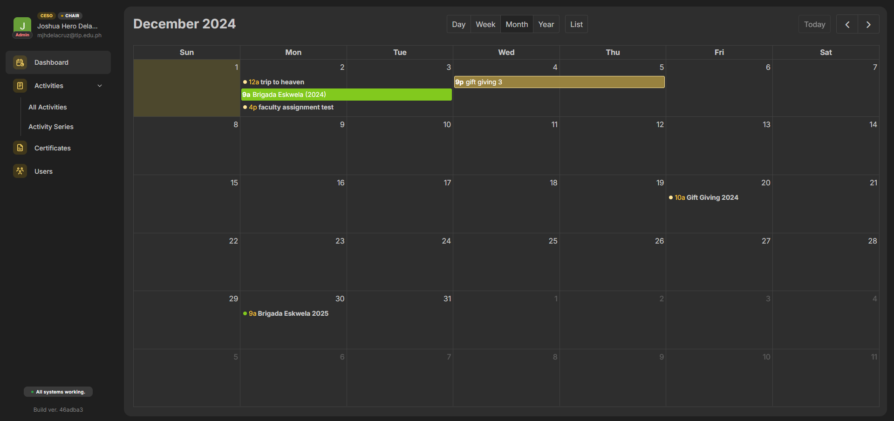<br />
_Dashboard Calendar using FullCalendar library._

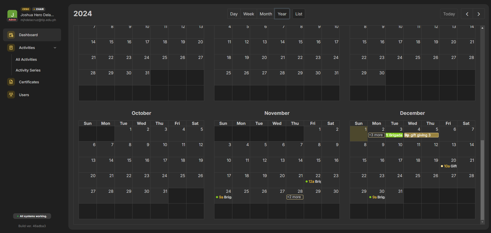<br />
_Dashboard Calendar Yearly Overview (FullCalendar.js)._

### Activities/Events

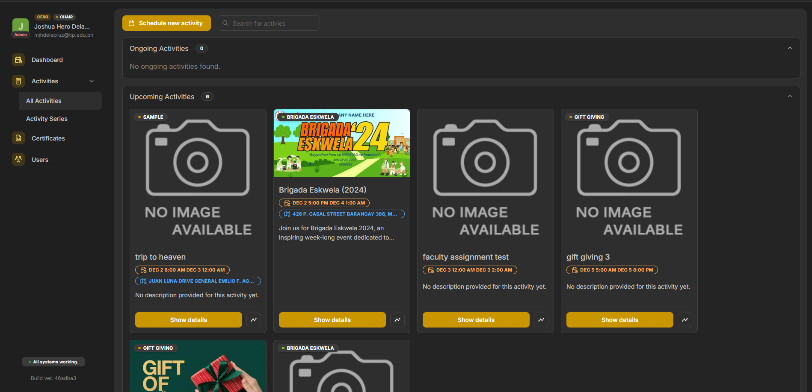<br />
_Event List_

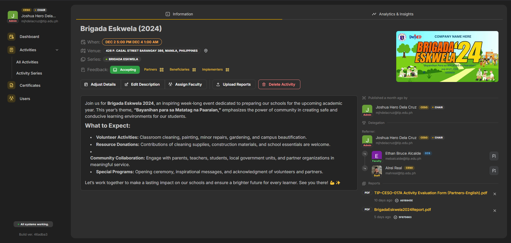<br />
_Event details with WYSIWYG editor, File uploads (Reports), Faculty Assignment (Delegation)._

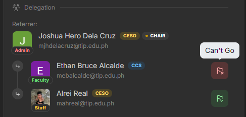<br />
_Event delegation response (w/ Email notice to respective authorities)._

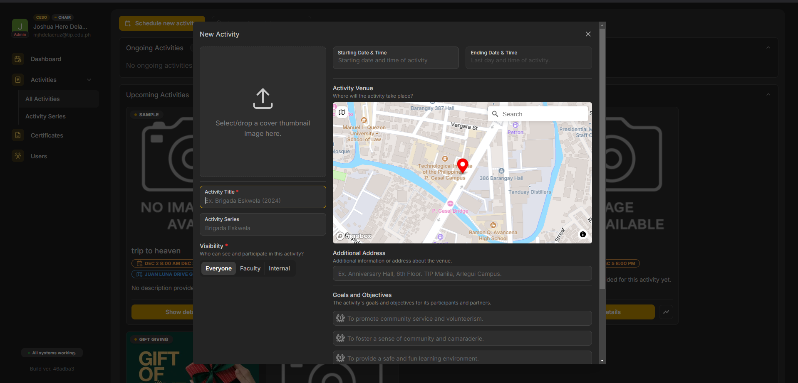<br />
_New/Update Event Form Modal with Mapbox Integration._

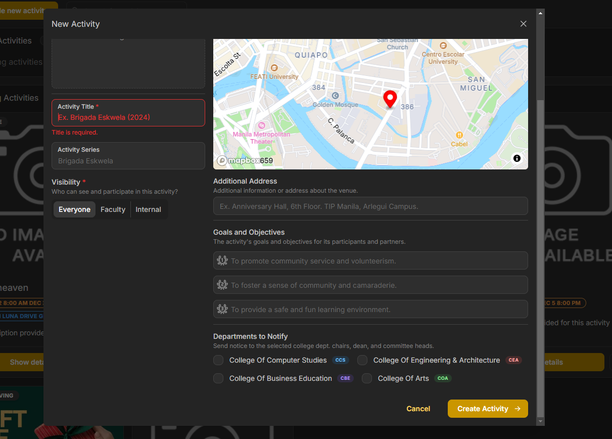<br />
_Goals & Objectives, Dept. to notify (email)._

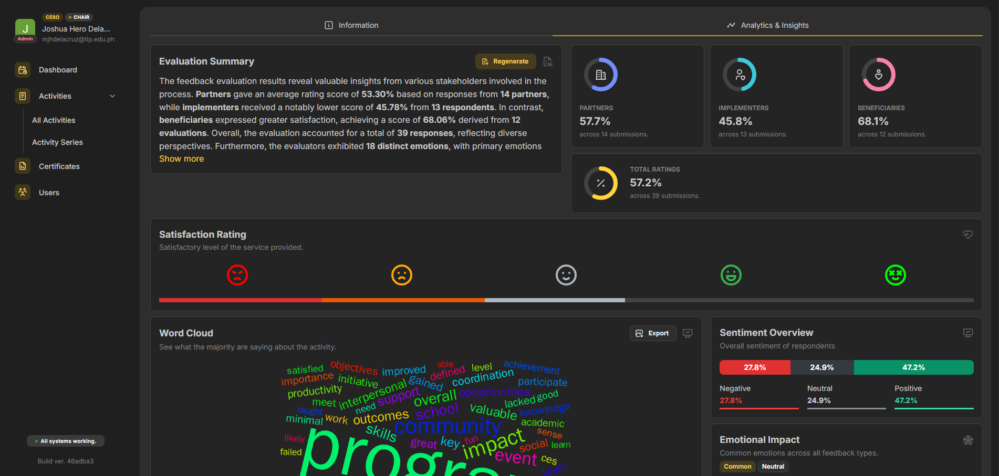<br />
_AI-Generated summary with overall ratings._

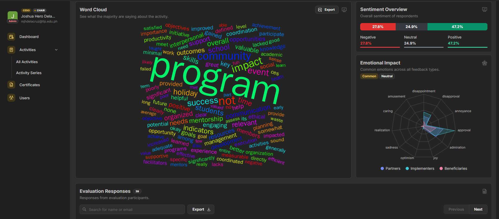<br />
_World cloud and overview of overall evaluation analysis._

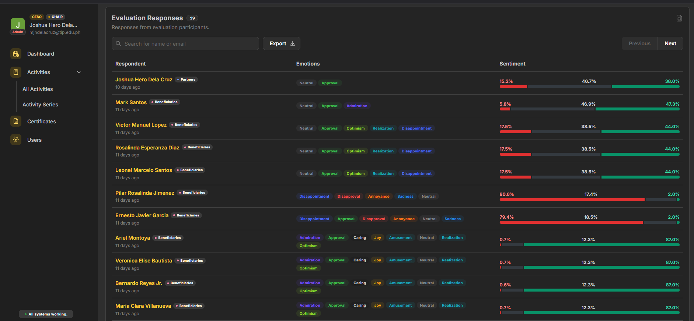<br />
_Sentiment Analysis and Emotion Analysis per evaluation._

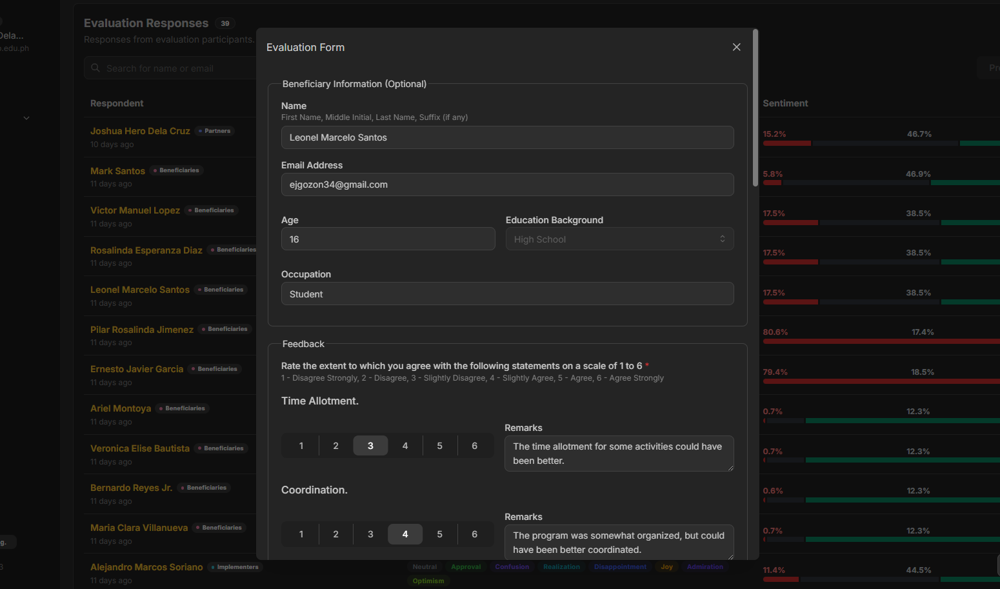<br />
_Copy of submitted evaluation form._

### Certificates

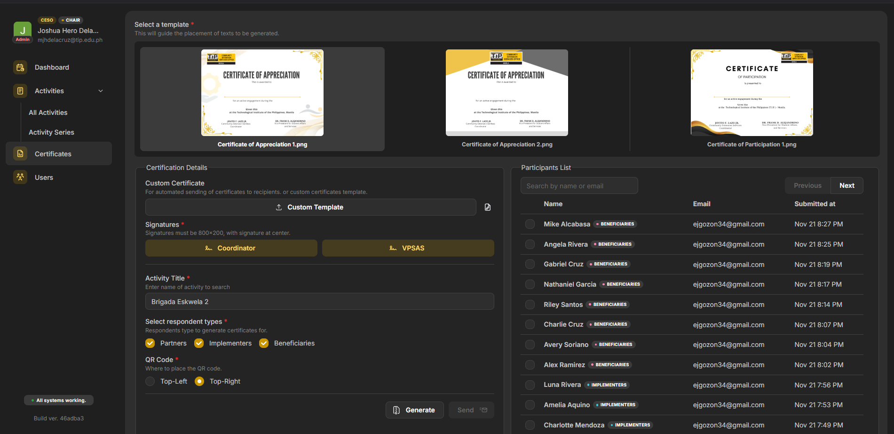<br />
_Participant lists for excluding in generation (attendance-related)._

The generated certificate also contains QR code for validation.

The `Generate` generates certificates locally (offline use), and downloads as ZIP file. The `Send` uses Trigger.dev integration.

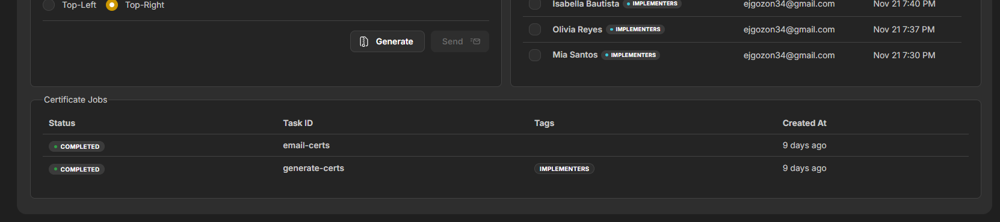<br />
_Integrated with Trigger.dev, monitor the status of the generation process._

## Development

### Prerequisites

1. Download and setup [bun](https://bun.sh).

2. Setup required instances of the ff.

   - [Supabase](https://database.new)
      - Configs can be acquired from `supabase/` directory.
   - [Trigger.dev](https://cloud.trigger.dev/)
   - [Resend](https://resend.com/login)
   - [HuggingFace](https://huggingface.co/)
   - GitHub Token (for GitHub Models, OpenAI GPT-4.0 mini)

3. Install dependencies using `bun install` or `bun i`.

4. After setting up Supabase tables, generate types locally:

   ```sh
   SUPABASE_PROJECT=your-project-id bun gen:t
   ```

### Setup

1. Setup acquired environment variables from services above in `.env` file.

   > A copy of `.env` file can be found in `.env.sample` file.

2. Configure Supabase Auth for [Google OAuth](https://supabase.com/docs/guides/auth/social-login/auth-google).

3. Configure `trigger.config.ts`:

   ```ts
   export const config: TriggerConfig = {
     project: '', // change to your trigger.dev project api
     // ...
   };
   ```

4. Run the application

   ```sh
   bun dev     # or dev:t to use turbo
   bun dev:em  # to run email previews by react-email
   ```

### Using Doppler for Secret Management (Optional)

This project used [Doppler](https://doppler.com) ([CLI](https://docs.doppler.com/docs/install-cli))
for secrets management, therefore most scripts are
tailored for such env variables to be available when
running them using:

```sh
doppler run -- bun gen:t
```

Or you can do an alias to shorten it:

```sh
alias dp='doppler run --'

# now you can run scripts using:
dp bun gen:t
# or
dp bun dev
```

You can upload your existing `.env` file using:

```sh
doppler secret upload .env
```

> [!NOTE]
>
> **You wouldn't need an `.env` file when using Doppler**.
> _(You can delete it)_
>
> It acquires the necessary secrets from doppler's dashboard
> using the CLI, and can be used across machines without manual transfers.

## Deployment

> [!NOTE]
> This project was deployed using [Vercel](https://vercel.com).
>
> Deploying to other providers are not tested, and is up to you.

After deploying the main application,
Don't forget to deploy the `Trigger.dev` triggers:

```sh
bun deploy:tr
# or
bunx trigger.dev@latest deploy
```

## License

This work is distributed under [Apache License, Version 2.0](https://opensource.org/license/apache-2-0).

[](https://app.fossa.com/projects/custom%2B26392%2Fgithub.com%2Fjhdcruz%2FProCESO?ref=badge_large&issueType=license)

## Disclaimer

All trademarks, logos, and service marks displayed on this website are the property of their respective owners.

- **Technological Institute of the Philippines (T.I.P)**

  T.I.P and the T.I.P logos are trademarks or registered trademarks of Technological Institute of the Philippines (
  T.I.P) in the Philippines.

- **Google, LLC.**

  Google and the Google logos are trademarks or registered trademarks of Google LLC in the United States and other countries.
